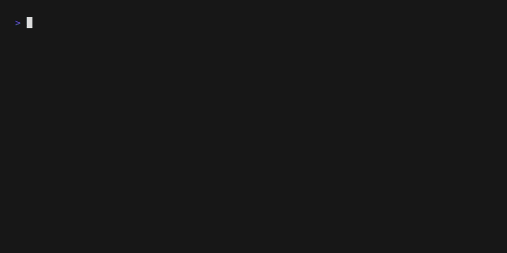

# Typing Test

A terminal-based typing test application written in Go that helps improve your typing speed and accuracy. Features both regular English text and Python code snippets for programming practice.



## Features

- **Real-time typing test** with live WPM (Words Per Minute) calculation
- **Accuracy tracking** with instant feedback on correct/incorrect characters
- **Multiple test modes**: Regular English text and Python code snippets
- **Terminal-based UI** with color-coded feedback
- **Random paragraph selection** for varied practice
- **Immediate restart capability** for continuous practice

## Installation

### Prerequisites

- Go 1.22.2 or later
- Terminal with color support

### Install from source

```bash
git clone https://github.com/arjunsharmahehe/FastFingers.git
cd FastFingers/src
go mod download
go build -o fastfinger .
```

### Run directly with Go

```bash
cd src
go run .
```

## Usage

### Basic Usage

Start the typing test with regular English paragraphs:

```bash
./fastfinger
```

Add a custom time limit in seconds (defaults to 60 seconds)
```bash
./fastfinger -time=15
```

### Python Code Mode

Practice typing Python code snippets:

```bash
./fastfinger -py
```

### Controls

- **Type normally** - Characters will be highlighted green (correct) or red (incorrect)
- **Escape** - Exit the application
- **Ctrl+C | R** - Restart with a new paragraph (after completing current test)

## How It Works

1. A random paragraph is selected from the available collection
2. Type the displayed text character by character
3. Real-time feedback shows:
   - **Green characters**: Correctly typed
   - **Red characters**: Incorrectly typed
   - **Cursor position**: Current character to type
4. Statistics display:
   - **Time elapsed**: Current session duration
   - **WPM**: Words per minute (calculated as characters/5/minutes)
   - **Accuracy**: Percentage of correctly typed characters

## Project Structure

```
├── assets/
│   └── typingDemo.gif          # Demo GIF
├── src/
│   ├── go.mod                  # Go module definition
│   ├── go.sum                  # Go module checksums
│   ├── main.go                 # Main application logic
│   └── paragraphs.go           # Text content for typing tests
└── README.md                   # This file
```

## Dependencies

- [termbox-go](https://github.com/nsf/termbox-go) - Cross-platform terminal UI library

## Development

### Building

```bash
cd src
go build -o fastfinger .
```

### Adding new paragraphs

Edit `paragraphs.go` to add new content to either the `paragraphs` array (English text) or `pythonParagraph` array (Python code).

## Contributing

1. Fork the repository
2. Create a feature branch (`git checkout -b feature/amazing-feature`)
3. Commit your changes (`git commit -m 'Add some amazing feature'`)
4. Push to the branch (`git push origin feature/amazing-feature`)
5. Open a Pull Request

## Future Enhancements

- [ ] Support for other programming languages (JavaScript, Java, etc.)
- [x] Customizable test duration
- [ ] Statistics persistence and progress tracking
- [ ] Difficulty levels with varying text complexity
- [ ] Export results to file

## Acknowledgments

- Built with [termbox-go](https://github.com/nsf/termbox-go) for terminal interface
- Inspired by various online typing test applications
